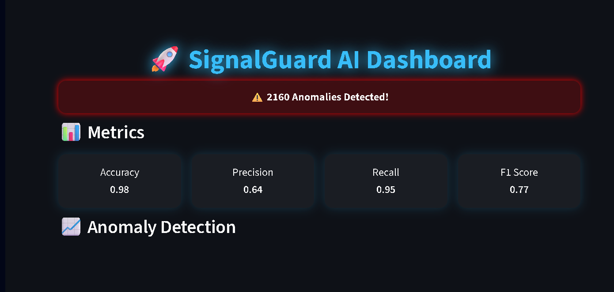
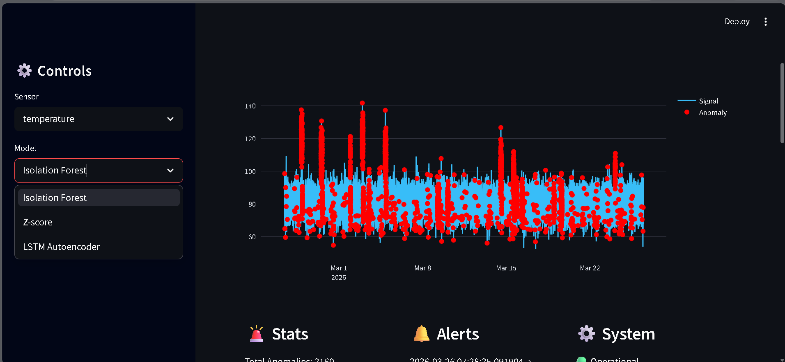
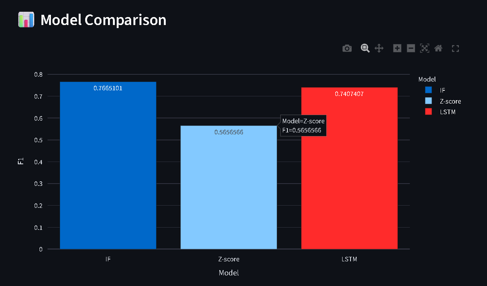
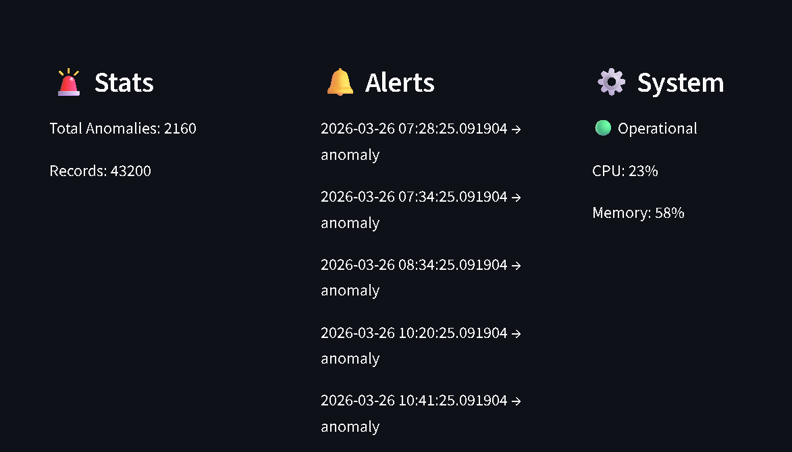
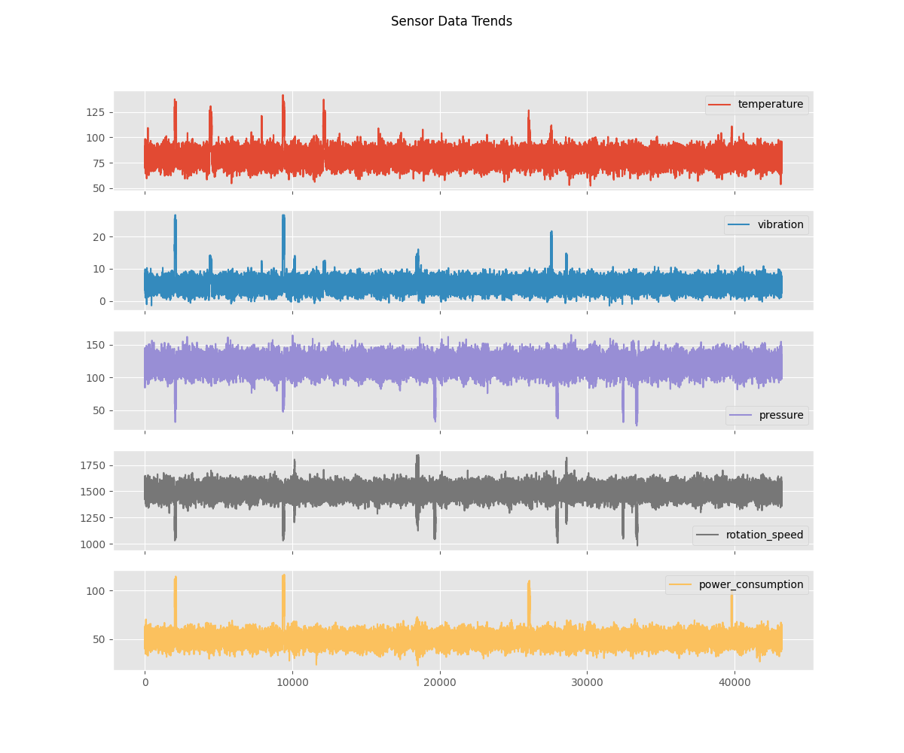
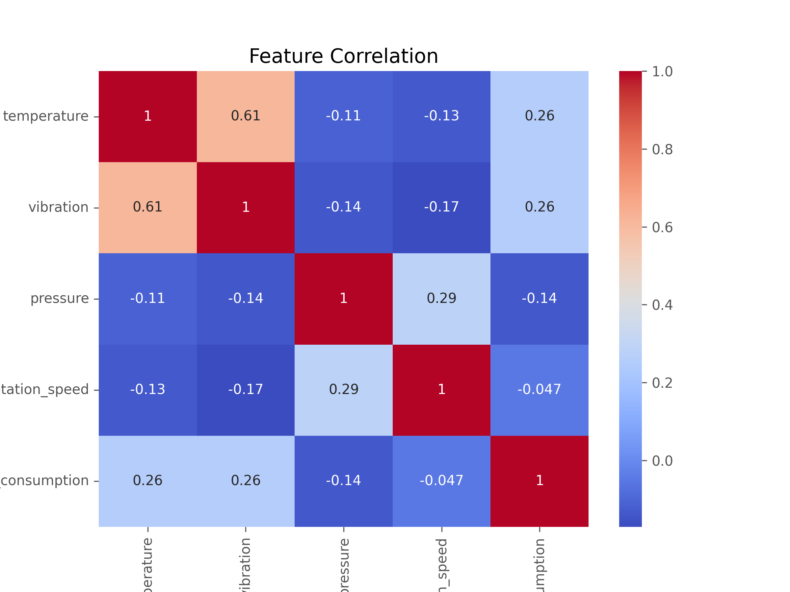
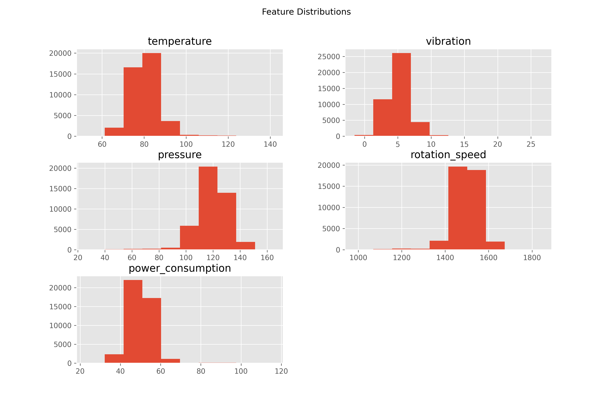
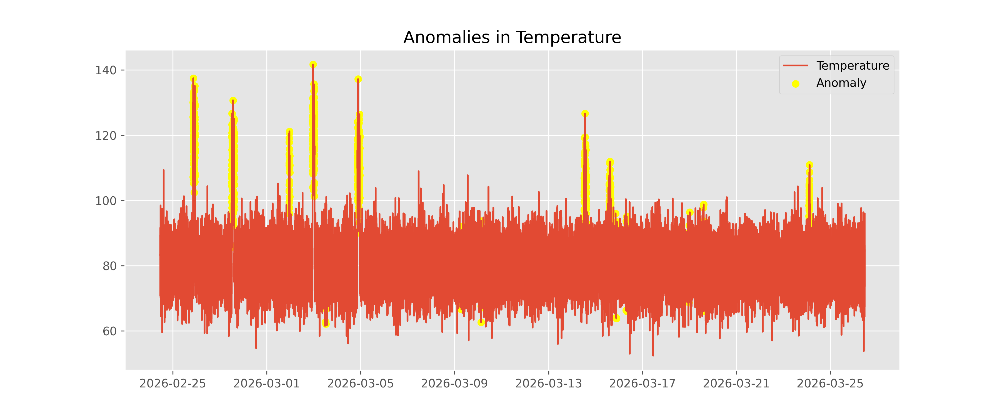

# SignalGuard — Time Series Anomaly Detection

A machine learning system for detecting anomalies in industrial sensor data — temperature, vibration, pressure, rotation speed, and power consumption. It compares three different detection approaches (statistical, machine learning, and deep learning) on the same data and ships with an interactive Streamlit dashboard for exploring the results.

[](https://www.python.org/)
[](https://streamlit.io/)
[](https://scikit-learn.org/)
[](https://www.tensorflow.org/)

**Repo:** [github.com/Deepika825325/Time_series_Anomaly_Detection](https://github.com/Deepika825325/Time_series_Anomaly_Detection)

---

## Why this project

Most anomaly detection tutorials pick one method and stop there. In practice, it's rarely obvious upfront whether a simple statistical rule, a tree-based model, or a neural network will work best on a given sensor signal — it depends on the noise profile, how anomalies present themselves, and how much labeled data you have.

This project builds all three side by side on the same industrial sensor dataset, evaluates them with the same metrics, and puts the results in a dashboard so the trade-offs are easy to see rather than buried in a notebook.

## How it works

Three detectors run over the same time-series data:

- **Z-score** — flags points that deviate significantly from a rolling mean. Cheap, interpretable, and a reasonable first line of defense.
- **Isolation Forest** — an unsupervised tree-based model that isolates outliers by how few splits it takes to separate them from the rest of the data.
- **LSTM Autoencoder** — learns to reconstruct normal temporal patterns; anomalies are the points it reconstructs badly.

The pipeline reads raw sensor data, engineers features, trains all three models, scores the data, and writes out metrics and predictions. Everything is driven by a single `config.yaml` so you can point it at different data or tune hyperparameters without touching code.

---

## Dashboard

The Streamlit dashboard lets you pick a sensor and a model from the sidebar and see anomalies highlighted on the live chart, alongside accuracy/precision/recall/F1 and system health.









A full walkthrough is also recorded in [`demo.mp4`](https://github.com/Deepika825325/Time_series_Anomaly_Detection/blob/main/demo.mp4) — GitHub plays it inline, no download needed.

---

## Exploratory data analysis

Before training anything, it's worth understanding what the data actually looks like. These plots come from the analysis in `notebooks/`.









A couple of things stood out during this analysis:

Temperature and vibration are the most correlated pair in the dataset (r ≈ 0.61), which tracks — on a rotating industrial system, heat and vibration tend to move together. Most features are roughly normally distributed around a stable operating range, and anomalies show up as sharp, short spikes rather than slow drift. That shape is part of why Isolation Forest does well here: it's built to isolate exactly this kind of point anomaly.

---

## Model performance

| Model | Accuracy | Precision | Recall | F1 |
|---|---|---|---|---|
| Isolation Forest | 0.98 | 0.64 | 0.95 | **0.77** |
| LSTM Autoencoder | 0.96 | 0.47 | 0.69 | 0.74 |
| Z-score | 0.97 | 0.94 | 0.40 | 0.57 |

Isolation Forest comes out ahead on F1, mainly because it catches far more true anomalies (recall 0.95) without sacrificing too much precision. Z-score is the most precise of the three but misses more than half the anomalies — it's a reasonable lightweight baseline, not something to rely on alone. LSTM Autoencoder is close behind Isolation Forest and would likely close the gap further with more training data or tuning, since it's the only one of the three actually modeling temporal dependencies rather than treating each point independently.

*(Numbers are approximate, taken from the latest evaluation run in `outputs/metrics/`.)*

---

## Project structure

```
Time_series_Anomaly_Detection/
├── app/                      # Streamlit dashboard
├── data/
│   └── raw/                  # Raw sensor data
├── notebooks/                # EDA and experimentation
├── outputs/
│   ├── metrics/              # Evaluation results (JSON)
│   ├── models/                # Trained model artifacts
│   ├── plots/                  # EDA visualizations
│   ├── screenshot/              # Dashboard screenshots (used in this README)
│   └── final_data.csv           # Scored dataset
├── src/                      # Pipeline source code
├── tests/                    # pytest suite
├── config.yaml               # Pipeline configuration
├── main.py                   # Entry point — runs the full training pipeline
├── requirements.txt
└── demo.mp4                  # Dashboard walkthrough
```

---

## Getting started

Clone the repo and set up a virtual environment:

```bash
git clone https://github.com/Deepika825325/Time_series_Anomaly_Detection.git
cd Time_series_Anomaly_Detection

python -m venv venv
venv\Scripts\activate        # Windows
source venv/bin/activate     # macOS / Linux

pip install -r requirements.txt
```

Run the pipeline to train all three models and generate metrics:

```bash
python main.py
```

This trains Z-score, Isolation Forest, and the LSTM Autoencoder, writes evaluation metrics to `outputs/metrics/`, and produces `outputs/final_data.csv` with anomaly predictions.

Then launch the dashboard:

```bash
streamlit run app/streamlit_app.py
```

and open `http://localhost:8501`.

## Running tests

```bash
python -m pytest tests/
```

This checks that the pipeline runs end to end and that all three models train and produce valid output.

## Configuration

Everything — data path, LSTM hyperparameters, output locations — is controlled from `config.yaml` at the repo root, so changing the dataset or retraining with different settings doesn't require touching the code:

```yaml
data:
  path: data/raw/sensor_dataset.csv

lstm:
  epochs: 5
  batch_size: 32

output:
  metrics_path: outputs/metrics/results.json
```

---

## What's next

A few directions this could go if I keep building on it:

- Streaming ingestion instead of batch, so the dashboard reflects live sensor data
- Email/SMS alerting when an anomaly is detected, rather than requiring someone to watch the dashboard
- Scheduled retraining as new data comes in
- A FastAPI wrapper so other services can query anomaly scores directly
- Dockerizing the whole thing for one-command deployment

---

## Author

**Deepika Kumari**

[GitHub](https://github.com/Deepika825325) · [LinkedIn](https://linkedin.com/in/deepikakri)